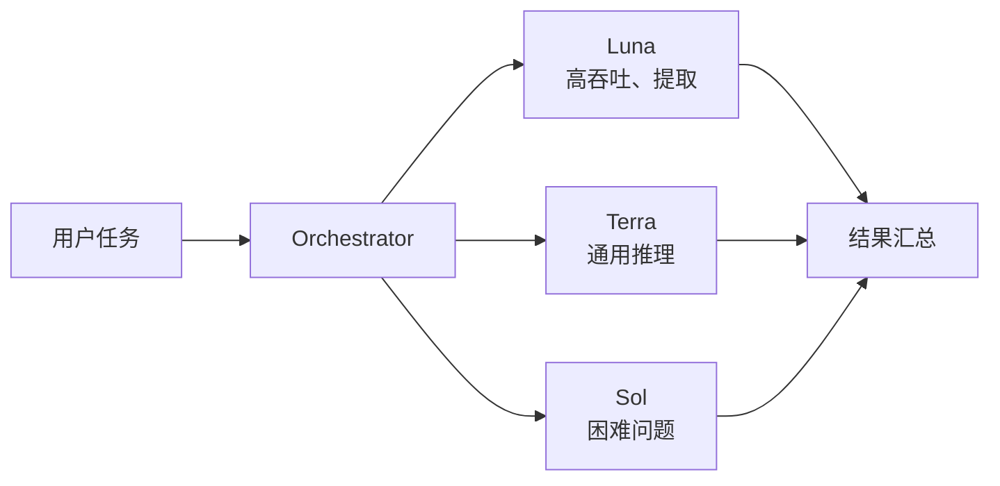
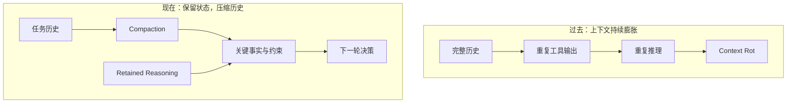
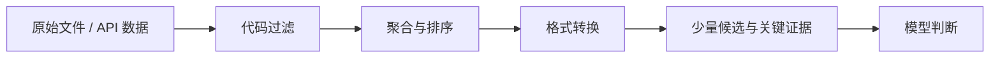
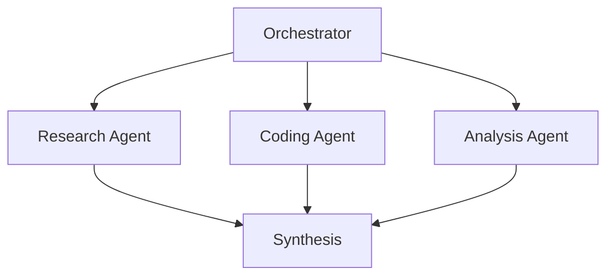
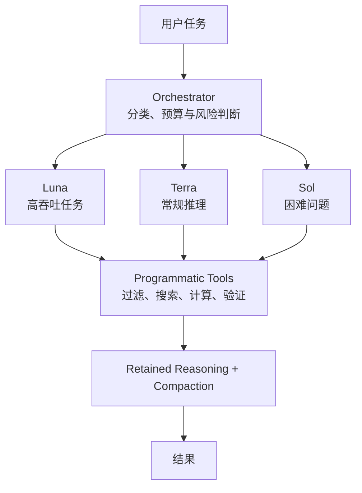

# GPT-5.6 与 Agent 工程范式转移

> 真正的变化不是「模型又变强了」，而是 Agent 的竞争开始从调用最强模型，转向更合理地组织和分配智能。

OpenAI 在 [The builder's guide to GPT-5.6](https://openai.com/index/builders-guide-to-gpt-5-6/) 中给出的案例，指向了同一个工程目标：**不要为所有任务使用最昂贵、推理强度最高的模型，而要提高每一美元能够买到的有效智能。**

这篇笔记把原文和讨论整理为五个 Agent 架构信号。

## 1. Bigger Model → Smarter Routing

传统的 Agent 设计很容易退化成一条直线：任务进入系统，直接交给最强模型，并默认开启最高推理强度。这种方案容易实现，却把分类、提取、常规推理和困难决策都按最高单价结算。

GPT-5.6 的 Luna、Terra、Sol 更适合被理解为一组可以调度的计算层：



原文给出的 BrowseComp 案例很有冲击力：

| 模型 | 得分 | 成本 |
|---|---:|---:|
| GPT-5.5 Extra High | 84.36% | $33.27 |
| GPT-5.6 Luna Extra High | 84.04% | $1.33 |

在这个特定评测中，两者效果接近，而 Luna 的成本约为前者的 **1/25**。重点并不是 Luna 可以替代所有强模型，而是：**许多任务根本不需要为最强能力付费。**

一个更合理的路由器至少需要观察：

- 任务类型：提取、检索、生成、规划还是复杂判断；
- 失败代价：是否允许重试，错误是否可被自动验证；
- 时延和预算：交互请求与离线批处理的约束不同；
- 升级条件：低成本模型失败后，何时转交更强模型。

## 2. Reasoning 不是越高越好

模型选择之外，推理强度本身也是一个调度维度。原文案例显示，GPT-5.6 Sol 在 low reasoning 下的 Agents' Last Exam 表现已经超过 GPT-5.5 high reasoning。

这把优化目标从 **Maximum Intelligence** 改成了 **Minimum Intelligence Required**：找到可靠完成任务所需的最低推理强度，再为少数困难样本逐级升级。

```text
默认策略：所有请求 → max reasoning

自适应策略：
请求 → low → 可验证成功 → 返回
             └→ 不确定/失败 → medium → high
```

降低推理强度省下的不只是 token，也包括响应时延。工程上可以用置信度、校验器、重试结果或任务风险作为升级信号，而不是让调用方凭感觉固定一个档位。

## 3. Context Window 不应该成为垃圾桶

长时间运行的 Agent 会不断积累对话、工具输出、中间推理和重复事实。把所有历史原样塞回模型，会导致成本增长、重复推理和 context rot：信息虽然更多，真正有用的信号却更难被找到。

原文强调了两个 primitive：**Retained Reasoning** 与 **Compaction**。



在文中的 ARC-AGI-3 案例里，这套 harness 调整让成绩从 **13.3% 提升到 38.3%**，同时输出 token 约减少 **6 倍**。这里最重要的观察是：模型没有变，改变的是模型外部的上下文管理方式。

因此，Agent 的记忆系统不应只是消息数组，还需要区分：

- 必须原样保留的约束和用户决策；
- 可以结构化保存的任务状态；
- 可以压缩的历史过程；
- 可以丢弃或外置的冗长工具输出。

## 4. Code handles computation; models handle judgment

如果 Agent 拿到了 100 份文件，最直接的做法是把文件全部交给模型，再让模型筛选、排序和汇总。这会把确定性计算变成昂贵的概率性计算。

更好的边界是：



能用代码稳定完成的工作——过滤、聚合、排序、去重、格式转换、精确查询——应该留在程序化工具中。模型更适合处理语义理解、歧义消解、方案权衡和最终判断。

这不是简单的「多调用工具」，而是重新划分计算边界：

> **Code handles computation. Models handle judgment.**

## 5. Multi-Agent ≠ Agent 越多越好

Multi-Agent 的价值来自并行和专业化，不来自 Agent 数量本身。一个常见结构是由 Orchestrator 拆解任务，让研究、编码和分析角色并行工作，最后统一综合：



只有两个条件同时成立时，拆分子 Agent 才通常值得：

1. 子任务确实可以独立或并行推进；
2. 额外 token 与协调成本能够换来更好的结果或更短的总时延。

如果任务高度串行、共享状态频繁变化，或者最终产物无法自动校验，多 Agent 反而可能用更多 token 制造更多协调成本。

## 一张图总结新的 Agent Stack



五个信号最终指向同一件事：

| 信号 | 工程原则 |
|---|---|
| Model Routing | 不同任务使用不同模型 |
| Adaptive Reasoning | 使用够用的推理强度 |
| Context Engineering | 保留关键状态，压缩历史 |
| Programmatic Tools | 确定性计算交给代码 |
| Selective Multi-Agent | 只在并行确实产生价值时拆分 |

下一阶段 Agent 的护城河，可能越来越不取决于「用了哪个模型」，而取决于「如何组织这些智能」。

> Better model ≠ Better agent. Better architecture does.

## 来源

- OpenAI：[The builder's guide to GPT-5.6](https://openai.com/index/builders-guide-to-gpt-5-6/)
- 本文由对话 **GPT-5.6 Agent Paradigm Shift** 的分析、X Thread 草稿与布局讨论重新整理而成。
